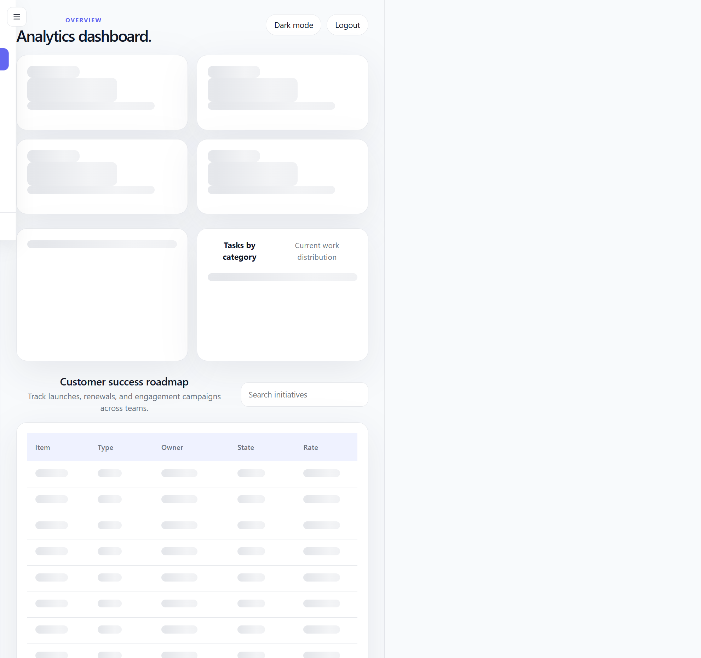
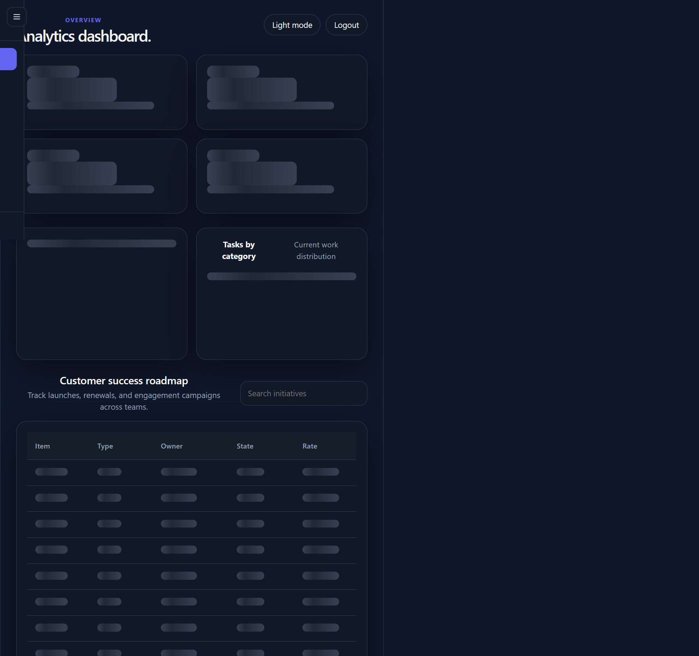

# SaaS Analytics Dashboard

A polished analytics dashboard experience built with React and TypeScript. The app presents project health, task distribution, and roadmap progress in a modern interface with built-in light and dark mode support.

## Screenshots

The dashboard includes both light and dark visual themes for the same experience:

### Light mode



### Dark mode



## Tech stack

- React 19 + TypeScript
- Vite for development and production builds
- React Router for protected routes and auth flow
- Recharts for data visualization
- Tailwind CSS for styling and theme support

## How to run locally

1. Install dependencies:
   ```bash
   npm install
   ```
2. Start the development server:
   ```bash
   npm run dev
   ```
3. Open the local app at:
   ```text
   http://localhost:3000/
   ```
4. Sign in with any valid email address and a password with at least 8 characters.

## Design decisions

- A clean, dashboard-first layout keeps key KPIs and charts visible without overwhelming the user.
- Protected routing ensures the main dashboard is only accessible after sign-in.
- Skeleton states and lightweight transitions make the UI feel responsive while content loads.
- A built-in theme toggle supports both light and dark viewing preferences.
- The project uses a component-driven structure so charts, cards, and tables can be reused and extended easily.

## Known trade-offs

- The app currently uses mock dashboard data rather than a live backend or API integration.
- Authentication is intentionally lightweight and persisted through browser storage for demo purposes.
- The table and charts are designed for a polished presentation rather than full production-scale data handling.
- There is no automated test suite yet, so visual verification remains the main quality check during iteration.

## Build for production

```bash
npm run build
```
